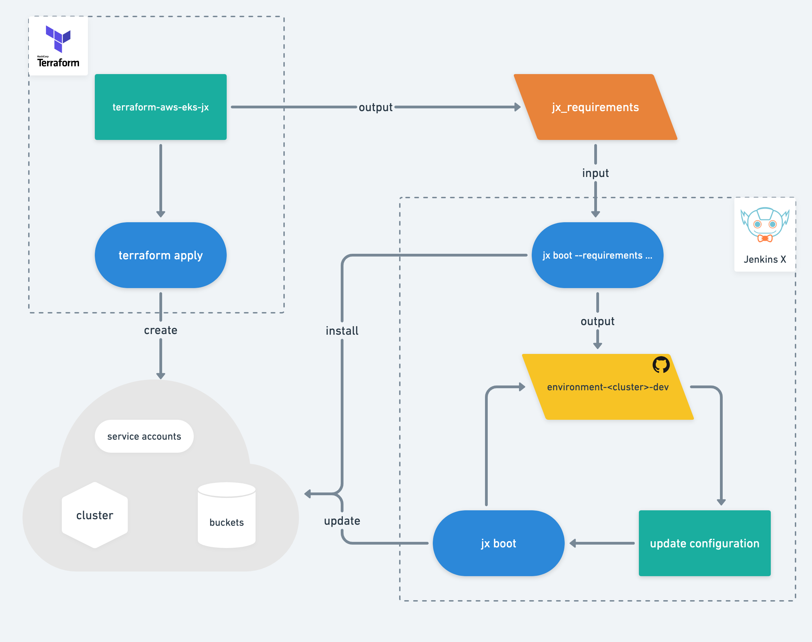

# Jenkins X EKS Module


This repository contains a Terraform module for creating an EKS cluster and all the necessary infrastructure to install Jenkins X via `jx boot`.

The module makes use of the [Terraform EKS cluster Module](https://github.com/terraform-aws-modules/terraform-aws-eks).

<!-- TOC -->

- [What is a Terraform module](#what-is-a-terraform-module)
- [How do you use this module](#how-do-you-use-this-module)
    - [Prerequisites](#prerequisites)
    - [Cluster provisioning](#cluster-provisioning)
        - [Inputs](#inputs)
        - [Outputs](#outputs)
    - [Long Term Storage](#long-term-storage)
    - [Vault](#vault)
    - [ExternalDNS](#externaldns)
    - [cert-manager](#cert-manager)
    - [Velero Backups](#velero-backups)
    - [Running `jx boot`](#running-jx-boot)
    - [Production cluster considerations](#production-cluster-considerations)
    - [Configuring a Terraform backend](#configuring-a-terraform-backend)
    - [Using Spot Instances](#using-spot-instances)
    - [EKS node groups](#eks-node-groups)
    - [AWS Auth](#aws-auth)
    - [Examples](#examples)
- [FAQ: Frequently Asked Questions](#faq-frequently-asked-questions)
    - [IAM Roles for Service Accounts](#iam-roles-for-service-accounts)
- [Development](#development)
    - [Releasing](#releasing)
- [How can I contribute](#how-can-i-contribute)

<!-- /TOC -->

## What is a Terraform module

A Terraform module refers to a self-contained package of Terraform configurations that are managed as a group.
For more information about modules refer to the Terraform [documentation](https://www.terraform.io/docs/modules/index.html).

## How do you use this module

### Prerequisites

This Terraform module allows you to create an [EKS](https://aws.amazon.com/eks/) cluster ready for the installation of Jenkins X.
You need the following binaries locally installed and configured on your _PATH_:

- `terraform` (=> 0.12.17, < 0.14.0)
- `kubectl` (>=1.10)
- `aws-cli`
- `aws-iam-authenticator`
- `wget`

### Cluster provisioning

A default Jenkins X ready cluster can be provisioned by creating a _main.tf_ file in an empty directory with the following content:

```terraform
module "eks-jx" {
  source = "jenkins-x/eks-jx/aws"
}

output "jx_requirements" {
  value = module.eks-jx.jx_requirements
}

output "vault_user_id" {
  value       = module.eks-jx.vault_user_id
  description = "The Vault IAM user id"
}

output "vault_user_secret" {
  value       = module.eks-jx.vault_user_secret
  description = "The Vault IAM user secret"
}

```

All s3 buckets created by the module use Server-Side Encryption with Amazon S3-Managed Encryption Keys 
(SSE-S3) by default.
You can set the value of `use_kms_s3` to true to use server-side encryption with AWS KMS (SSE-KMS).
If you don't specify the value of `s3_kms_arn`, then the default aws managed cmk is used (aws/s3) 

:warning: **Note**: Using AWS KMS with customer managed keys has cost 
[considerations](https://aws.amazon.com/blogs/storage/changing-your-amazon-s3-encryption-from-s3-managed-encryption-sse-s3-to-aws-key-management-service-sse-kms/).

Due to the Vault issue [7450](https://github.com/hashicorp/vault/issues/7450), this Terraform module needs for now to create a new IAM user for installing Vault.
It also creates an IAM access key whose id and secret are defined in the output above.
You need the id and secret for running [`jx boot`](#running-jx-boot).

The _jx_requirements_ output is a helper for creating the initial input for `jx boot`.

If you do not want Terraform to create a new IAM user or you do not have permissions to create one, you need to provide the name of an existing IAM user.

```terraform
module "eks-jx" {
  source     = "jenkins-x/eks-jx/aws"
  vault_user = "<your_vault_iam_username>"
}
```

You should have your [AWS CLI configured correctly](https://docs.aws.amazon.com/cli/latest/userguide/cli-configure-quickstart.html).
In addition, you should make sure to specify the region via the AWS_REGION environment variable. e.g. `export AWS_REGION=us-east-1`

The IAM user does not need any permissions attached to it.
For more information, refer to [Configuring Vault for EKS](https://jenkins-x.io/docs/install-setup/installing/boot/clouds/amazon/#configuring-vault-for-eks) in the Jenkins X documentation.

Once you have your initial configuration, you can apply it by running:

```sh
terraform init
terraform apply
```

This creates an EKS cluster with all possible configuration options defaulted.

You then need to export the environment variables _VAULT_AWS_ACCESS_KEY_ID_ and _VAULT_AWS_SECRET_ACCESS_KEY_.

```sh
export VAULT_AWS_ACCESS_KEY_ID=$(terraform output vault_user_id)
export VAULT_AWS_SECRET_ACCESS_KEY=$(terraform output vault_user_secret)
```

If you specified _vault_user_ you need to provide the access key id and secret for the specified user.

:warning: **Note**: This example is for getting up and running quickly.
It is not intended for a production cluster.
Refer to [Production cluster considerations](#production-cluster-considerations) for things to consider when creating a production cluster.

The following sections provide a full list of configuration in- and output variables.

#### Inputs

| Name | Description | Type | Default | Required |
|------|-------------|------|---------|:--------:|
| apex\_domain | The main domain to either use directly or to configure a subdomain from | `string` | `""` | no |
| cluster\_in\_private\_subnet | Flag to enable installation of cluster on private subnets | `bool` | `false` | no |
| cluster\_name | Variable to provide your desired name for the cluster. The script will create a random name if this is empty | `string` | `""` | no |
| cluster\_version | Kubernetes version to use for the EKS cluster. | `string` | `"1.15"` | no |
| create\_and\_configure\_subdomain | Flag to create an NS record set for the subdomain in the apex domain's Hosted Zone | `bool` | `false` | no |
| desired\_node\_count | The number of worker nodes to use for the cluster | `number` | `3` | no |
| enable\_backup | Whether or not Velero backups should be enabled | `bool` | `false` | no |
| enable\_external\_dns | Flag to enable or disable External DNS in the final `jx-requirements.yml` file | `bool` | `false` | no |
| enable\_key\_name | Flag to enable ssh key pair name | `bool` | `false` | no |
| enable\_key\_rotation | Flag to enable kms key rotation | `bool` | `true` | no |
| enable\_logs\_storage | Flag to enable or disable long term storage for logs | `bool` | `true` | no |
| enable\_nat\_gateway | Should be true if you want to provision NAT Gateways for each of your private networks | `bool` | `false` | no |
| enable\_node\_group | Flag to enable node group | `bool` | `false` | no |
| enable\_reports\_storage | Flag to enable or disable long term storage for reports | `bool` | `true` | no |
| enable\_repository\_storage | Flag to enable or disable the repository bucket storage | `bool` | `true` | no |
| enable\_spot\_instances | Flag to enable spot instances | `bool` | `false` | no |
| enable\_tls | Flag to enable TLS in the final `jx-requirements.yml` file | `bool` | `false` | no |
| enable\_worker\_group | Flag to enable worker group | `bool` | `true` | no |
| force\_destroy | Flag to determine whether storage buckets get forcefully destroyed. If set to false, empty the bucket first in the aws s3 console, else terraform destroy will fail with BucketNotEmpty error | `bool` | `false` | no |
| iops | The IOPS value | `number` | `0` | no |
| key\_name | The ssh key pair name | `string` | n/a | yes |
| map\_accounts | Additional AWS account numbers to add to the aws-auth configmap. | `list(string)` | `[]` | no |
| map\_roles | Additional IAM roles to add to the aws-auth configmap. | <pre>list(object({<br>    rolearn  = string<br>    username = string<br>    groups   = list(string)<br>  }))</pre> | `[]` | no |
| map\_users | Additional IAM users to add to the aws-auth configmap. | <pre>list(object({<br>    userarn  = string<br>    username = string<br>    groups   = list(string)<br>  }))</pre> | `[]` | no |
| max\_node\_count | The maximum number of worker nodes to use for the cluster | `number` | `5` | no |
| min\_node\_count | The minimum number of worker nodes to use for the cluster | `number` | `3` | no |
| node\_group\_ami | ami type for the node group worker intances | `string` | `"AL2_x86_64"` | no |
| node\_group\_disk\_size | node group worker disk size | `string` | `"50"` | no |
| node\_machine\_type | The instance type to use for the cluster's worker nodes | `string` | `"m5.large"` | no |
| private\_subnets | The private subnet CIDR block to use in the created VPC | `list(string)` | <pre>[<br>  "10.0.4.0/24",<br>  "10.0.5.0/24",<br>  "10.0.6.0/24"<br>]</pre> | no |
| production\_letsencrypt | Flag to use the production environment of letsencrypt in the `jx-requirements.yml` file | `bool` | `false` | no |
| public\_subnets | The public subnet CIDR block to use in the created VPC | `list(string)` | <pre>[<br>  "10.0.1.0/24",<br>  "10.0.2.0/24",<br>  "10.0.3.0/24"<br>]</pre> | no |
| region | The region to create the resources into | `string` | `"us-east-1"` | no |
| s3\_kms\_arn | ARN of the kms key used for encrypting s3 buckets | `string` | `""` | no |
| single\_nat\_gateway | Should be true if you want to provision a single shared NAT Gateway across all of your private networks | `bool` | `false` | no |
| spot\_price | The spot price ceiling for spot instances | `string` | `"0.1"` | no |
| subdomain | The subdomain to be added to the apex domain. If subdomain is set, it will be appended to the apex domain in  `jx-requirements-eks.yml` file | `string` | `""` | no |
| tls\_email | The email to register the LetsEncrypt certificate with. Added to the `jx-requirements.yml` file | `string` | `""` | no |
| use\_kms\_s3 | Flag to determine whether kms should be used for encrypting s3 buckets | `bool` | `false` | no |
| vault\_url | URL to an external Vault instance in case Jenkins X does not create its own system Vault | `string` | `""` | no |
| vault\_user | The AWS IAM Username whose credentials will be used to authenticate the Vault pods against AWS | `string` | `""` | no |
| velero\_namespace | Kubernetes namespace for Velero | `string` | `"velero"` | no |
| velero\_schedule | The Velero backup schedule in cron notation to be set in the Velero Schedule CRD (see [default-backup.yaml](https://github.com/jenkins-x/jenkins-x-boot-config/blob/master/systems/velero-backups/templates/default-backup.yaml)) | `string` | `"0 * * * *"` | no |
| velero\_ttl | The the lifetime of a velero backup to be set in the Velero Schedule CRD (see [default-backup.yaml](https://github.com/jenkins-x/jenkins-x-boot-config/blob/master/systems/velero-backups/templates/default-backup)) | `string` | `"720h0m0s"` | no |
| volume\_size | The volume size in GB | `number` | `10` | no |
| volume\_type | The volume type to use. Can be standard, gp2 or io1 | `string` | `"gp2"` | no |
| vpc\_cidr\_block | The vpc CIDR block | `string` | `"10.0.0.0/16"` | no |
| vpc\_name | The name of the VPC to be created for the cluster | `string` | `"tf-vpc-eks"` | no |

#### Outputs

| Name | Description |
|------|-------------|
| backup\_bucket\_url | The bucket where backups from velero will be stored |
| cert\_manager\_iam\_role | The IAM Role that the Cert Manager pod will assume to authenticate |
| cluster\_name | The name of the created cluster |
| cm\_cainjector\_iam\_role | The IAM Role that the CM CA Injector pod will assume to authenticate |
| controllerbuild\_iam\_role | The IAM Role that the ControllerBuild pod will assume to authenticate |
| external\_dns\_iam\_role | The IAM Role that the External DNS pod will assume to authenticate |
| jx\_requirements | The jx-requirements rendered output |
| jxui\_iam\_role | The IAM Role that the Jenkins X UI pod will assume to authenticate |
| lts\_logs\_bucket | The bucket where logs from builds will be stored |
| lts\_reports\_bucket | The bucket where test reports will be stored |
| lts\_repository\_bucket | The bucket that will serve as artifacts repository |
| tekton\_bot\_iam\_role | The IAM Role that the build pods will assume to authenticate |
| vault\_dynamodb\_table | The Vault DynamoDB table |
| vault\_kms\_unseal | The Vault KMS Key for encryption |
| vault\_unseal\_bucket | The Vault storage bucket |
| vault\_user\_id | The Vault IAM user id |
| vault\_user\_secret | The Vault IAM user secret |


### Long Term Storage

You can choose to create S3 buckets for [long term storage](https://jenkins-x.io/docs/install-setup/installing/boot/storage/) of Jenkins X build artefacts with `enable_logs_storage`, `enable_reports_storage` and `enable_repository_storage`.

During `terraform apply` the enabledS3 buckets are created, and the _jx_requirements_ output will contain the following section:

```yaml
    storage:
      logs:
        enabled: ${enable_logs_storage}
        url: s3://${logs_storage_bucket}
      reports:
        enabled: ${enable_reports_storage}
        url: s3://${reports_storage_bucket}
      repository:
        enabled: ${enable_repository_storage}
        url: s3://${repository_storage_bucket}
```

If you just want to experiment with Jenkins X, you can set the variable _force_destroy_ to true.
This allows you to remove all generated buckets when running terraform destroy.

:warning: **Note**: If you set `force_destroy` to false, and run a `terraform destroy`, it will fail. In that case empty the s3 buckets from the aws s3 console, and re run `terraform destroy`.

### Vault

Vault is used by Jenkins X for managing secrets.
Part of this module's responsibilities is the creation of all resources required to run the [Vault Operator](https://github.com/banzaicloud/bank-vaults).
These resources are An S3 Bucket, a DynamoDB Table and a KMS Key.

You can also configure an existing Vault instance for use with Jenkins X.
In this case provide the Vault URL via the _vault_url_  input variable and follow the Jenkins X documentation around the instllation of an [external Vault](https://jenkins-x.io/docs/install-setup/installing/boot/secrets/#external) instance.

### ExternalDNS

You can enable [ExternalDNS](https://github.com/kubernetes-sigs/external-dns) with the `enable_external_dns` variable. This modifies the generated _jx-requirements.yml_ file to enable External DNS when running `jx boot`.

If `enable_external_dns` is _true_, additional configuration is required.

If you want to use a domain with an already existing Route 53 Hosted Zone, you can provide it through the `apex_domain` variable:

This domain will be configured in the _jx_requirements_ output in the following section:

```yaml
    ingress:
      domain: ${domain}
      ignoreLoadBalancer: true
      externalDNS: ${enable_external_dns}
```

If you want to use a subdomain and have this module create and configure a new Hosted Zone with DNS delegation, you can provide the following variables:

`subdomain`: This subdomain is added to the apex domain and configured in the resulting _jx-requirements.yml_ file.

`create_and_configure_subdomain`: This flag instructs the script to create a new `Route53 Hosted Zone` for your subdomain and configure DNS delegation with the apex domain.

By providing these variables, the script creates a new `Route 53` HostedZone that looks like `<subdomain>.<apex_domain>`, then it delegates the resolving of DNS to the apex domain.
This is done by creating a `NS` RecordSet in the apex domain's Hosted Zone with the subdomain's HostedZone nameservers.

This ensures that the newly created HostedZone for the subdomain is instantly resolvable instead of having to wait for DNS propagation.

### cert-manager

You can enable [cert-manager](https://github.com/jetstack/cert-manager) to use TLS for your cluster through LetsEncrypt with the `enable_tls` variable.

[LetsEncrypt](https://letsencrypt.org/) has two environments, `staging` and `production`.

If you use staging, you will receive self-signed certificates, but you are not rate-limited, if you use the `production` environment, you receive certificates signed by LetsEncrypt, but you can be rate limited.

You can choose to use the `production` environment with the `production_letsencrypt` variable:

You need to provide a valid email to register your domain in LetsEncrypt with `tls_email`.

### Velero Backups

This module can set up the resources required for running backups with Velero on your cluster by setting the flag `enable_backup` to `true`.

#### Enabling backups on pre-existing clusters

If your cluster is pre-existing and already contains a namespace named `velero`, then enabling backups will initially fail with an error that you are trying to create a namespace which already exists.

```
Error: namespaces "velero" already exists
```

If you get this error, consider it a warning - you may then adjust accordingly by importing that namespace to be managed by Terraform, deleting the previously existing ns if it wasn't actually in use, or setting `enable_backup` back to `false` to continue managing Velero in the previous manner.

The recommended way is to import the namespace and then run another Terraform plan and apply:

```
terraform import module.eks-jx.module.backup.kubernetes_namespace.velero_namespace velero
```

### Running `jx boot`

A terraform output (_jx_requirements_) is available after applying this Terraform module.

```sh
terraform output jx_requirements
```

This _jx_requirements_ output can be used as input to [Jenkins X Boot](https://jenkins-x.io/docs/getting-started/setup/boot/) which is responsible for installing all the required Jenkins X components into the cluster created by this module.



:warning: **Note**: The generated _jx\_requirements_ output is only intended for the first run of `jx boot`.
During this first run of `jx boot` a git repository containing the source code for Jenkins X Boot is created.
This (_new_) repository contains a _jx-requirements.yml_ (_which is now ahead of the jx-requirements output from terraform_) used by successive runs of `jx boot`.

Execute:

```sh
terraform output jx_requirements > <some_empty_dir>/jx-requirements.yml
cd <some_empty_dir>
jx boot --requirements jx-requirements.yml
```

You are prompted for any further required configuration.
The number of prompts depends on how much you have [pre-configured](#inputs) via your Terraform variables.

:grey_exclamation: Remember you need to export _VAULT_AWS_ACCESS_KEY_ID_ and _VAULT_AWS_SECRET_ACCESS_KEY_.
See [Cluster provisioning](#cluster-provisioning).

### Production cluster considerations

The configuration, as seen in [Cluster provisioning](#cluster-provisioning), is not suited for creating and maintaining a production Jenkins X cluster.
The following is a list of considerations for a production use case.

- Specify the version attribute of the module, for example:

    ```terraform
    module "eks-jx" {
      source  = "jenkins-x/eks-jx/aws"
      version = "1.0.0"
      # insert your configuration
    }

    output "jx_requirements" {
      value = module.eks-jx.jx_requirements
    }  
    ```

  Specifying the version ensures that you are using a fixed version and that version upgrades cannot occur unintended.

- Keep the Terraform configuration under version control by creating a dedicated repository for your cluster configuration or by adding it to an already existing infrastructure repository.

- Setup a Terraform backend to securely store and share the state of your cluster. For more information refer to [Configuring a Terraform backend](#configuring-a-terraform-backend).

### Configuring a Terraform backend

A "[backend](https://www.terraform.io/docs/backends/index.html)" in Terraform determines how state is loaded and how an operation such as _apply_ is executed.
By default, Terraform uses the _local_ backend, which keeps the state of the created resources on the local file system.
This is problematic since sensitive information will be stored on disk and it is not possible to share state across a team.
When working with AWS a good choice for your Terraform backend is the [_s3_ backend](https://www.terraform.io/docs/backends/types/s3.html)  which stores the Terraform state in an AWS S3 bucket.
The [examples](./examples) directory of this repository contains configuration examples for using the _s3_ backed.

To use the _s3_ backend, you will need to create the bucket upfront.
You need the S3 bucket as well as a Dynamo table for state locks.
You can use [terraform-aws-tfstate-backend](https://github.com/cloudposse/terraform-aws-tfstate-backend) to create these required resources.

### Using Spot Instances

You can save up to 90% of cost when you use Spot Instances. You just need to make sure your applications are resilient. You can set the ceiling `spot_price` of what you want to pay then set `enable_spot_instances` to `true`.

:warning: **Note**: If the price of the instance reaches this point it will be terminated.

### EKS node groups

This module provisions self-managed worker nodes by default.

If you want AWS to manage the provisioning and lifecycle of worker nodes for EKS, you can opt for [managed node groups](https://docs.aws.amazon.com/eks/latest/userguide/managed-node-groups.html).

They have the added benefit of running the latest Amazon EKS-optimized AMIs and gracefully drain nodes before termination to ensure that your applications stay available.

In order to provision EKS node groups create a _main.tf_ with the following content:

```terraform
module "eks-jx" {
  source  = "jenkins-x/eks-jx/aws"
  enable_node_group   = true
  enable_worker_group = false
}

output "jx_requirements" {
  value = module.eks-jx.jx_requirements
}

output "vault_user_id" {
  value       = module.eks-jx.vault_user_id
  description = "The Vault IAM user id"
}

output "vault_user_secret" {
  value       = module.eks-jx.vault_user_secret
  description = "The Vault IAM user secret"
}
```

:warning: **Note**: If you forget to set `enable_worker_group = false`, then the module will provision both self managed worker groups and node groups.

:warning: **Note**: EKS node groups are supported in kubernetes v1.14+ and platform version eks.3

:warning: **Note**: Spot instances are not supported for EKS node groups. Check this AWS [issue](https://github.com/aws/containers-roadmap/issues/583) for more details.

### AWS Auth

When running EKS, authentication for the cluster is controlled by a `configmap` called `aws-auth`. By default, that should look something like this:

```
apiVersion: v1
data:
  mapAccounts: |
    []
  mapRoles: |
    - "groups":
      - "system:bootstrappers"
      - "system:nodes"
      "rolearn": "arn:aws:iam::777777777777:role/project-eks-12345"
      "username": "system:node:{{EC2PrivateDNSName}}"
  mapUsers: |
    []
kind: ConfigMap
metadata:
  name: aws-auth
  namespace: kube-system
```

When using this Terraform module, this AWS Auth configmap is generated for you via the EKS module that is used internally. Additional users, roles, and accounts may be mapped into this config map by providing the variables `map_users`, `map_roles` or `map_accounts` respectively.

#### `map_users`

To add an additional AWS IAM user named "patrick", you can create an `aws_iam_user` resource, and then use the `map_users` variable to allow Patrick to access EKS:

```
resource "aws_iam_user" "patrick" {
  name = "patrick"
}

module "eks-jx" {
  source  = "jenkins-x/eks-jx/aws"
  map_users = [
    {
      userarn  = aws_iam_user.patrick.arn
      username = aws_iam_user.patrick.name
      groups   = ["system:masters"]
    }
  ]
}
```

#### `map_roles`

To map additional roles to the AWS Auth ConfigMap, use `map_roles`:

```terraform
module "eks-jx" {
  source  = "jenkins-x/eks-jx/aws"
  map_roles = [
    {
      rolearn  = "arn:aws:iam::66666666666:role/role1"
      username = "role1"
      groups   = ["system:masters"]
    },
  ]
}
```

#### `map_accounts`

To map additional accounts to the AWS Auth ConfigMap, use `map_accounts`:

```terraform
module "eks-jx" {
  source  = "jenkins-x/eks-jx/aws"
  map_accounts = [
    "777777777777",
    "888888888888",
  ]
}
```

### Using SSH Key Pair
Import a key pair or use an existing one and take note of the name.
Set `key_name` and set `enable_key_name` to `true`.

### Using different EBS Volume type and size
Set `volume_type` to either `standard`, `gp2` or `io1` and `volume_size` to the desired size in GB. If chosing `io1` set desired `iops`.

#### Resizing a disk on existing nodes
The existing nodes needs to be terminated and replaced with new ones if disk is needed to be resized.
You need to execute the following command before `terraform apply` in order to replace the Auto Scaling Launch Configuration.

`terraform taint module.eks-jx.module.cluster.module.eks.aws_launch_configuration.workers[0]`

### Examples

You can find examples for different configurations in the [examples folder](./examples).

Each example generates a valid _jx-requirements.yml_ file that can be used to boot a Jenkins X cluster.

## FAQ: Frequently Asked Questions

### IAM Roles for Service Accounts

This module sets up a series of IAM Policies and Roles. These roles will be annotated into a few Kubernetes Service accounts.
This allows us to make use of [IAM Roles for Sercive Accounts](https://docs.aws.amazon.com/eks/latest/userguide/iam-roles-for-service-accounts.html) to set fine-grained permissions on a pod per pod basis.
There is no way to provide your own roles or define other Service Accounts by variables, but you can always modify the `modules/cluster/irsa.tf` Terraform file.

## Development

### Releasing

At the moment, there is no release pipeline defined in [jenkins-x.yml](./jenkins-x.yml).
A Terraform release does not require building an artifact; only a tag needs to be created and pushed.
To make this task easier and there is a helper script `release.sh` which simplifies this process and creates the changelog as well:

```sh
./scripts/release.sh
```

This can be executed on demand whenever a release is required.
For the script to work, the environment variable _$GH_TOKEN_ must be exported and reference a valid GitHub API token.

## How can I contribute

Contributions are very welcome! Check out the [Contribution Guidelines](./CONTRIBUTING.md) for instructions.

